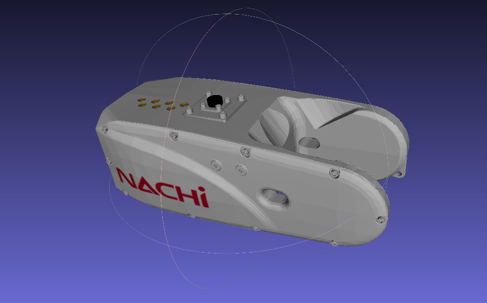
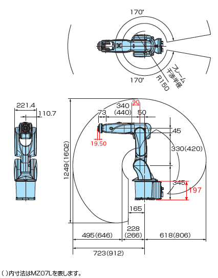

# MZ07の仕様


Solidworksで求めた各パーツの質量と慣性モーメント（推定）

## MZ07の質量特性: 
基となったファイルによるとロボット全体の質量は23.564999 kg，サイトの記述によるとMZ07の質量は30 kgなのでそれに合わせて各パーツの慣性モーメントを求め直した．  

* ｺﾝﾌｨｷﾞｭﾚｰｼｮﾝ: ﾃﾞﾌｫﾙﾄ
* 座標系: 座標系1

```
質量 = 23.564999 kilograms

体積 = 0.023565 cubic meters

表面積 = 1.242665 square meters

重心: ( ﾒｰﾄﾙ )
    X = 0.041037
    Y = -0.000037
    Z = 0.383769

慣性主要軸と慣性主ﾓｰﾒﾝﾄ: ( kilograms * square meters )
重心： 
     Ix = ( 0.296736,  0.000053,  0.954960)       Px = 0.225779
     Iy = ( 0.954959,  0.000602, -0.296736)       Py = 1.661122
     Iz = (-0.000591,  1.000000,  0.000129)       Pz = 1.755656

慣性ﾓｰﾒﾝﾄ: ( kilograms * square meters )
重心で計算、そして出力座標系と整列します。
    Lxx = 1.534737    Lxy = 0.000078    Lxz = 0.406734
    Lyx = 0.000078    Lyy = 1.755656    Lyz = 0.000060
    Lzx = 0.406734    Lzy = 0.000060    Lzz = 0.352164

慣性ﾓｰﾒﾝﾄ: ( kilograms * square meters )
（出力座標系で計算）
    Ixx = 5.005361    Ixy = 0.000042    Ixz = 0.777851
    Iyx = 0.000042    Iyy = 5.265964    Iyz = -0.000278
    Izx = 0.777851    Izy = -0.000278    Izz = 0.391848
```

##base_linkの質量特性: 
* ｺﾝﾌｨｷﾞｭﾚｰｼｮﾝ: ﾃﾞﾌｫﾙﾄ
* 座標系: 座標系1

```
質量 (ﾕｰｻﾞｰによる上書き済み) = 9.522365 kilograms

体積 = 0.007480 cubic meters

表面積 = 0.336730 square meters

重心: ( ﾒｰﾄﾙ )
    X = -0.033796
    Y = -0.000025
    Z = 0.099944

慣性主要軸と慣性主ﾓｰﾒﾝﾄ: ( kilograms * square meters )
重心： 
     Ix = ( 0.997474, -0.000652,  0.071034)       Px = 0.049278
     Iy = ( 0.071035,  0.001388, -0.997473)       Py = 0.069097
     Iz = ( 0.000552,  0.999999,  0.001431)       Pz = 0.077359

慣性ﾓｰﾒﾝﾄ: ( kilograms * square meters )
重心で計算、そして出力座標系と整列します。
    Lxx = 0.049378    Lxy = -0.000017    Lxz = 0.001404
    Lyx = -0.000017    Lyy = 0.077359    Lyz = -0.000013
    Lzx = 0.001404    Lzy = -0.000013    Lzz = 0.068997

慣性ﾓｰﾒﾝﾄ: ( kilograms * square meters )
（出力座標系で計算）
    Ixx = 0.144495    Ixy = -0.000009    Ixz = -0.030760
    Iyx = -0.000009    Iyy = 0.183352    Iyz = -0.000037
    Izx = -0.030760    Izy = -0.000037    Izz = 0.079873
```

## link_1の質量特性: 
* ｺﾝﾌｨｷﾞｭﾚｰｼｮﾝ: ﾃﾞﾌｫﾙﾄ  
* 座標系: 座標系1

```
質量 (ﾕｰｻﾞｰによる上書き済み) = 5.616960 kilograms

体積 = 0.004412 cubic meters

表面積 = 0.240734 square meters

重心: ( ﾒｰﾄﾙ )
    X = 0.014842
    Y = 0.000017
    Z = 0.086192

慣性主要軸と慣性主ﾓｰﾒﾝﾄ: ( kilograms * square meters )
重心： 
     Ix = ( 0.000506,  0.999999,  0.001575)       Px = 0.030098
     Iy = ( 0.498207, -0.001618,  0.867056)       Py = 0.035085
     Iz = ( 0.867058,  0.000347, -0.498208)       Pz = 0.049210

慣性ﾓｰﾒﾝﾄ: ( kilograms * square meters )
重心で計算、そして出力座標系と整列します。
    Lxx = 0.045704    Lxy = -0.000002    Lxz = 0.006101
    Lyx = -0.000002    Lyy = 0.030098    Lyz = 0.000010
    Lzx = 0.006101    Lzy = 0.000010    Lzz = 0.038591

慣性ﾓｰﾒﾝﾄ: ( kilograms * square meters )
（出力座標系で計算）
    Ixx = 0.087433    Ixy = 0.000000    Ixz = 0.013287
    Iyx = 0.000000    Iyy = 0.073064    Iyz = 0.000019
    Izx = 0.013287    Izy = 0.000019    Izz = 0.039829
```

## link_2の質量特性: 
* ｺﾝﾌｨｷﾞｭﾚｰｼｮﾝ: ﾃﾞﾌｫﾙﾄ
* 座標系: 座標系1

```
質量 (ﾕｰｻﾞｰによる上書き済み) = 7.350069 kilograms

体積 = 0.005773 cubic meters

表面積 = 0.286243 square meters

重心: ( ﾒｰﾄﾙ )
    X = -0.010731
    Y = -0.000070
    Z = 0.156069

慣性主要軸と慣性主ﾓｰﾒﾝﾄ: ( kilograms * square meters )
重心： 
     Ix = (-0.004989,  0.002061,  0.999985)       Px = 0.035063
     Iy = ( 0.000696, -0.999998,  0.002065)       Py = 0.099677
     Iz = ( 0.999987,  0.000706,  0.004988)       Pz = 0.120437

慣性ﾓｰﾒﾝﾄ: ( kilograms * square meters )
重心で計算、そして出力座標系と整列します。
    Lxx = 0.120434    Lxy = -0.000015    Lxz = -0.000426
    Lyx = -0.000015    Lyy = 0.099677    Lyz = 0.000133
    Lzx = -0.000426    Lzy = 0.000133    Lzz = 0.035065

慣性ﾓｰﾒﾝﾄ: ( kilograms * square meters )
（出力座標系で計算）
    Ixx = 0.299465    Ixy = -0.000010    Ixz = -0.012735
    Iyx = -0.000010    Iyy = 0.279554    Iyz = 0.000053
    Izx = -0.012735    Izy = 0.000053    Izz = 0.035911
```

## link_3の質量特性: 
* ｺﾝﾌｨｷﾞｭﾚｰｼｮﾝ: ﾃﾞﾌｫﾙﾄ
* 座標系: 座標系1

```
質量 (ﾕｰｻﾞｰによる上書き済み) = 3.724767 kilograms

体積 = 0.002926 cubic meters

表面積 = 0.124779 square meters

重心: ( ﾒｰﾄﾙ )
    X = -0.009050
    Y = -0.000351
    Z = 0.020551

慣性主要軸と慣性主ﾓｰﾒﾝﾄ: ( kilograms * square meters )
重心： 
     Ix = ( 0.961183,  0.005571,  0.275854)       Px = 0.009828
     Iy = ( 0.275902, -0.011683, -0.961115)       Py = 0.014178
     Iz = (-0.002132,  0.999916, -0.012767)       Pz = 0.017654

慣性ﾓｰﾒﾝﾄ: ( kilograms * square meters )
重心で計算、そして出力座標系と整列します。
    Lxx = 0.010160    Lxy = 0.000031    Lxz = 0.001153
    Lyx = 0.000031    Lyy = 0.017653    Lyz = 0.000051
    Lzx = 0.001153    Lzy = 0.000051    Lzz = 0.013848

慣性ﾓｰﾒﾝﾄ: ( kilograms * square meters )
（出力座標系で計算）
    Ixx = 0.011733    Ixy = 0.000043    Ixz = 0.000461
    Iyx = 0.000043    Iyy = 0.019531    Iyz = 0.000024
    Izx = 0.000461    Izy = 0.000024    Izz = 0.014154
```

## link_4の質量特性: 
* ｺﾝﾌｨｷﾞｭﾚｰｼｮﾝ: ﾃﾞﾌｫﾙﾄ
* 座標系: 座標系1

```
質量 (ﾕｰｻﾞｰによる上書き済み) = 3.245188 kilograms

体積 = 0.002549 cubic meters

表面積 = 0.158879 square meters

重心: ( ﾒｰﾄﾙ )
    X = 0.106528
    Y = 0.000953
    Z = 0.000727

慣性主要軸と慣性主ﾓｰﾒﾝﾄ: ( kilograms * square meters )
重心： 
     Ix = ( 0.999743,  0.022683,  0.000310)       Px = 0.007131
     Iy = (-0.022685,  0.999679,  0.011291)       Py = 0.017372
     Iz = (-0.000054, -0.011295,  0.999936)       Pz = 0.019281

慣性ﾓｰﾒﾝﾄ: ( kilograms * square meters )
重心で計算、そして出力座標系と整列します。
    Lxx = 0.007136    Lxy = 0.000232    Lxz = 0.000003
    Lyx = 0.000232    Lyy = 0.017367    Lyz = 0.000022
    Lzx = 0.000003    Lzy = 0.000022    Lzz = 0.019281

慣性ﾓｰﾒﾝﾄ: ( kilograms * square meters )
（出力座標系で計算）
    Ixx = 0.007141    Ixy = 0.000562    Ixz = 0.000255
    Iyx = 0.000562    Iyy = 0.054197    Iyz = 0.000024
    Izx = 0.000255    Izy = 0.000024    Izz = 0.056111
```

## link_5の質量特性: 
* ｺﾝﾌｨｷﾞｭﾚｰｼｮﾝ: ﾃﾞﾌｫﾙﾄ
* 座標系: 座標系1

```
質量 (ﾕｰｻﾞｰによる上書き済み) = 0.501938 kilograms

体積 = 0.000394 cubic meters

表面積 = 0.075417 square meters

重心: ( ﾒｰﾄﾙ )
    X = 0.023040
    Y = -0.004479
    Z = -0.000021

慣性主要軸と慣性主ﾓｰﾒﾝﾄ: ( kilograms * square meters )
重心： 
     Ix = ( 0.914394,  0.404820, -0.001902)       Px = 0.000505
     Iy = (-0.404775,  0.914199, -0.019908)       Py = 0.000649
     Iz = (-0.006321,  0.018973,  0.999800)       Pz = 0.000685

慣性ﾓｰﾒﾝﾄ: ( kilograms * square meters )
重心で計算、そして出力座標系と整列します。
    Lxx = 0.000529    Lxy = 0.000053    Lxz = 0.000000
    Lyx = 0.000053    Lyy = 0.000625    Lyz = -0.000001
    Lzx = 0.000000    Lzy = -0.000001    Lzz = 0.000685

慣性ﾓｰﾒﾝﾄ: ( kilograms * square meters )
（出力座標系で計算）
    Ixx = 0.000539    Ixy = 0.000001    Ixz = 0.000000
    Iyx = 0.000001    Iyy = 0.000892    Iyz = -0.000001
    Izx = 0.000000    Izy = -0.000001    Izz = 0.000962
```

## link_6の質量特性: 
* ｺﾝﾌｨｷﾞｭﾚｰｼｮﾝ: ﾃﾞﾌｫﾙﾄ
* 座標系: 座標系1

```
質量 (ﾕｰｻﾞｰによる上書き済み) = 0.038575 kilograms

体積 = 0.000030 cubic meters

表面積 = 0.019011 square meters

重心: ( ﾒｰﾄﾙ )
    X = 0.007083
    Y = -0.000142
    Z = 0.000269

慣性主要軸と慣性主ﾓｰﾒﾝﾄ: ( kilograms * square meters )
重心： 
     Ix = ( 0.000100,  0.988352,  0.152182)       Px = 0.000014
     Iy = (-0.000956, -0.152182,  0.988352)       Py = 0.000015
     Iz = ( 1.000000, -0.000244,  0.000930)       Pz = 0.000027

慣性ﾓｰﾒﾝﾄ: ( kilograms * square meters )
重心で計算、そして出力座標系と整列します。
    Lxx = 0.000027    Lxy = 0.000000    Lxz = 0.000000
    Lyx = 0.000000    Lyy = 0.000014    Lyz = 0.000000
    Lzx = 0.000000    Lzy = 0.000000    Lzz = 0.000015

慣性ﾓｰﾒﾝﾄ: ( kilograms * square meters )
（出力座標系で計算）
    Ixx = 0.000027    Ixy = 0.000000    Ixz = 0.000000
    Iyx = 0.000000    Iyy = 0.000016    Iyz = 0.000000
    Izx = 0.000000    Izy = 0.000000    Izz = 0.000017
```

## 各ジョイントの位置
公式サイト画像，加筆．  
CADファイルより寸法を計測して，ジョイントの位置を決定した．



> 世界最速 軽量コンパクトロボット MZ07  
> [http://www.nachi-fujikoshi.co.jp/rob/hand/mz07b.htm](http://www.nachi-fujikoshi.co.jp/rob/hand/mz07b.htm)